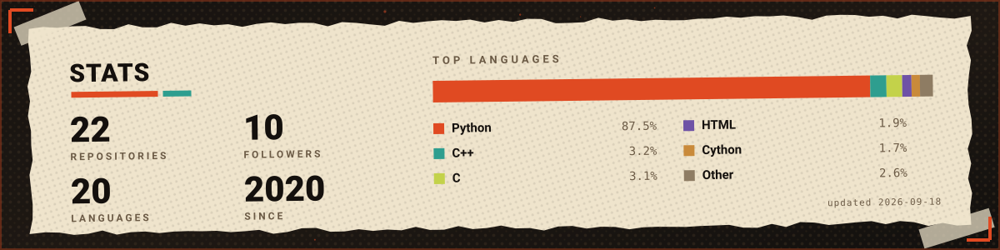
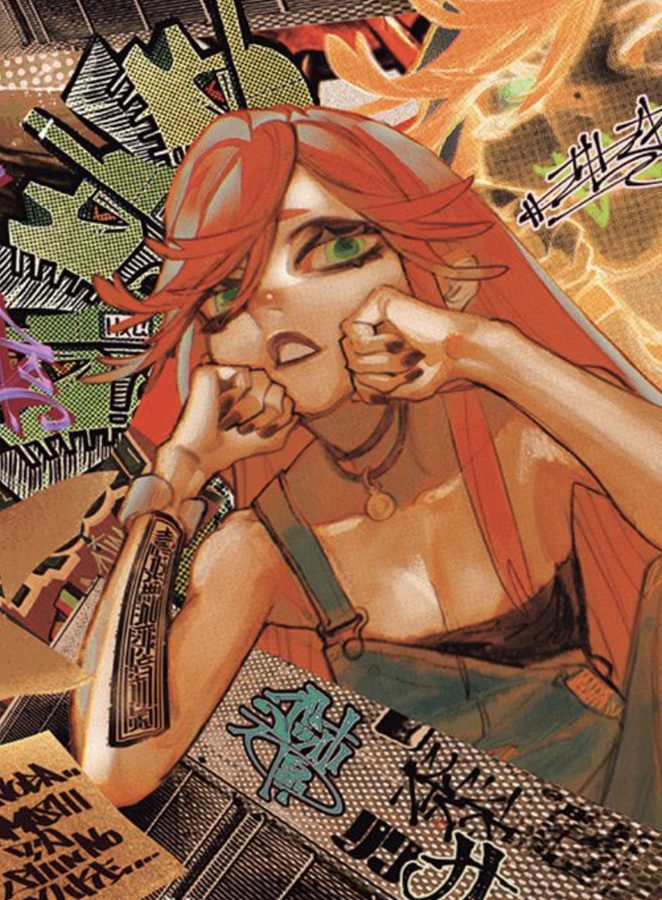
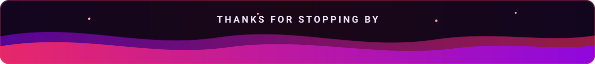

<p align="center">
  <a href="https://git.io/typing-svg"></a>
</p>

<p align="center">
  
  <a href="https://github.com/Berke-aras?tab=followers"></a>
  
  
</p>

---

### `❯` whoami

```yaml
name:      Berke Aras
role:      full-stack & Apple-platform developer
stack:     Python · Swift · TypeScript · Godot
building:  scrapers, iOS apps, anime-adjacent side projects
location:  Türkiye
```

- Backend & automation in **Python**, native apps in **Swift**, web in **TypeScript**
- Occasional detours into **Godot** for game dev
- Currently open to work

---

### `❯` stack

<p align="center">
  <a href="https://skillicons.dev">
    
  </a>
  <br />
  <a href="https://skillicons.dev">
    
  </a>
</p>

---

### `❯` stats



---

### `❯` projects

- **[portfolio](https://github.com/Berke-aras/portfolio)** — personal site with a Persona 5 inspired design
- **[berke-chatmate-pro](https://github.com/Berke-aras/berke-chatmate-pro)** — VS Code sidebar chat for any OpenAI-compatible API
- **[HuconAnimeOdulleri](https://github.com/Berke-aras/HuconAnimeOdulleri)** — anime awards voting site
- **[animetierlist](https://github.com/Berke-aras/animetierlist)** — drag-and-drop anime tier list builder
- **[HUCON](https://github.com/Berke-aras/HUCON)** — convention website
- **[Desktop-waifu-samples](https://github.com/Berke-aras/Desktop-waifu-samples)** — desktop mascot / live wallpaper experiments

---

### `❯` anime.log

```txt
> currently on       : Gachiakuta
> comfort genre      : dark shounen, gritty art, loud panels
> side effect        : half my repos are anime projects
```

<p align="center">
  
  <br />
  <sub><i>Gachiakuta — © Kei Urana / Kodansha</i></sub>
</p>

---

<p align="center">
  <a href="https://berke-aras.github.io/portfolio/"></a>
  <a href="https://github.com/Berke-aras"></a>
</p>


